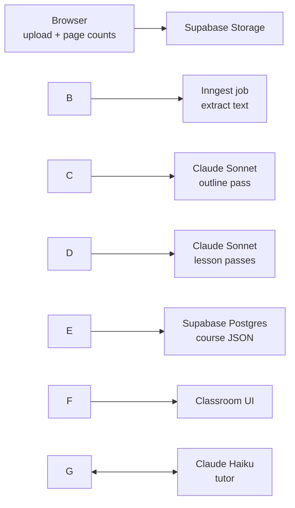

# UniTute — MVP Build Plan

Sep 25, 2026 · @Harvey

## Overview

The MVP is a browser-based web app that turns a unit's lecture slides and readings into an interactive course with a classroom, knowledge checks and an AI tutor. It runs in any modern browser on phone, tablet or desktop, with nothing to install. The goal is to prove the idea on your own units and with classmates before spending money on payments, video processing or public pages.

**In the MVP**

* Upload of PDF, PPTX and DOCX files into a content box and a learning objectives box, plus an additional notes box
* File-to-week matching, auto-filled from file names and editable before generation
* Course length choice: cram, recommended or deep
* AI course generation: curriculum, lessons and questions
* Classroom with collapsible curriculum and tutor sidebars, working on all screen sizes
* Knowledge checks throughout, with per-concept mastery tracking
* AI tutor chat linked to the content it was asked about
* Accounts, saved progress and an editable knowledge level
* Dark mode on by default, calming design, a simple bug report button
* Courses shared by private link

**Left for version 2**

Video, payments and credits, public SEO pages, course deduplication, the prerequisite quiz, course-specific learning tools, and knowledge levels shared across courses. Each is listed with its approach under Costs, risks and version 2.

## Tech stack and accounts

Everything runs on free tiers except the Anthropic API, which is pay-as-you-go. One language (TypeScript) is used across the whole app, so Claude Code can work on any part without switching context.

|Part|Choice|Why|Account needed|
|-|-|-|-|
|Web framework|Next.js (App Router) + TypeScript|Front end and API routes in one project|No|
|Styling and motion|Tailwind CSS + Framer Motion|Fast to build, easy dark mode, smooth animations|No|
|Hosting|Vercel|Free tier, deploys on every git push|Yes (free)|
|Accounts, database, file storage|Supabase|Auth, Postgres and storage in one free tier|Yes (free)|
|Long-running jobs|Inngest|Course generation takes minutes; this runs it in resumable steps past Vercel's time limits|Yes (free tier)|
|AI|Anthropic API: Claude Sonnet for generation, Claude Haiku for the tutor|Sonnet for quality, Haiku keeps tutor chat cheap|Yes (prepaid credit)|
|File reading in the browser|pdf.js, JSZip|Page and slide counts before upload|No|
|File reading on the server|Claude's native PDF input; officeparser for PPTX and DOCX text|PDFs keep their diagrams; Office files give text|No|
|Code|GitHub|Version history, connects to Vercel|Yes (free)|



Files go from the browser to storage, a background job extracts and generates the course in steps, and the classroom reads the finished course from the database.

## Data model

A course is stored as units, lessons and content blocks, and every block has a stable ID so tutor messages, progress and bug reports can point at it. Mastery is tracked per concept, not per lesson, because the same concept can appear in several lessons.

|Table|Holds|Key columns|
|-|-|-|
|profiles|One row per user|id, display\_name|
|courses|Course metadata|id, owner\_id, title, university, course\_code, year, length\_mode, status, share\_token|
|source\_files|Uploaded files|id, course\_id, box (content or objectives), week, filename, page\_count, storage\_path, extracted\_text|
|units|Weeks or topics|id, course\_id, position, title, summary|
|lessons|Lessons in a unit|id, unit\_id, position, title, est\_minutes, blocks (JSON array, each with its own id)|
|concepts|Ideas the course teaches|id, course\_id, name, description|
|lesson\_concepts|Which lessons cover which concepts|lesson\_id, concept\_id|
|questions|Knowledge check questions|id, lesson\_id, concept\_id, type, prompt, options, answer, explanation|
|attempts|Every answer given|user\_id, question\_id, correct, answered\_at|
|mastery|Knowledge level per concept|user\_id, concept\_id, score, attempts, user\_override|
|lesson\_progress|Where the user is up to|user\_id, lesson\_id, last\_block\_id, completed\_at|
|tutor\_messages|Tutor chat history|id, user\_id, course\_id, role, content, anchor\_block\_id|
|bug\_reports|Problems users flag|id, user\_id, course\_id, block\_id, note|

**Knowledge level**

Each answer updates the concept's mastery score (0 to 1) with a simple formula, so no LLM call is needed. The step size shrinks as attempts grow, so early answers move the score quickly and later ones fine-tune it.

```latex
\\\\\\\\text{score}\\\\\\\_{new} = \\\\\\\\text{score} + \\\\\\\\frac{1}{\\\\\\\\text{attempts} + 2}\\\\\\\\,(\\\\\\\\text{result} - \\\\\\\\text{score})
```

Here result is 1 for a correct answer and 0 for a wrong one. If the user edits their level, the value goes in user\_override and takes priority until they answer more questions on that concept.

For the tutor, the mastery rows are turned into short plain text, one line per concept, for example: Big-O notation: 0.72 (8 answers). This keeps the level readable by an LLM without storing it as text.

## Build phases

Build in seven phases, each ending with something working you can test in the browser. The classroom comes before the AI pipeline because it defines the course format that generation must produce, and it can be tested with a hand-written sample course.

1. **Setup.** Create the accounts, scaffold Next.js with Tailwind, push to GitHub, connect Vercel.

   * Done when: a placeholder page is live at a Vercel URL.
2. **Classroom UI with a sample course.** Define the course JSON schema, write one sample course by hand, and build the classroom: curriculum sidebar, lesson view, tutor sidebar (not yet connected), dark mode toggle, background gradients.

   * Done when: the sample course is fully navigable on a phone and a laptop in both themes.
3. **Accounts and progress.** Supabase auth (email magic link and Google), the database tables, saving lesson progress.

   * Done when: you can sign in, leave a lesson, come back on another device and resume where you left off.
4. **Upload and extraction.** Upload page with the two boxes and notes, browser-side page counts, a file list with week dropdowns filled from file names, upload to storage, text extraction in a background job.

   * Done when: uploading one of your units shows every file matched to a week and its extracted text saved.
5. **Course generation.** The outline pass (units, lessons, concepts, weighted by the learning objectives files), then one pass per lesson for blocks and questions, and the length slider controlling lesson count and depth. Log tokens used per course.

   * Done when: a real course from your own unit opens in the classroom and reads well.
6. **Knowledge checks and mastery.** Question types (multiple choice, short answer marked by Haiku, ordering), the mastery formula, progress shown in the curriculum sidebar, an editable knowledge level page.

   * Done when: answering questions visibly moves mastery, and editing it sticks.
7. **AI tutor and launch polish.** Tutor chat with the knowledge level and current lesson in its context, anchor linking between chat and content (connector lines on desktop, jump chips on mobile), a daily message limit per user, the bug report button, share links.

   * Done when: a classmate can open your link, sign in, study and use the tutor.

## Design system

The look is calm and focused: a deep navy base in dark mode, slow-drifting blurred colour blobs behind frosted panels, and generous spacing. All colours are CSS variables so the theme toggle swaps them in one place.

|Element|Dark (default)|Light|
|-|-|-|
|Background|Deep navy #0E1320|Warm off-white #F6F4EF|
|Background blobs|Teal, violet and peach at 15–25% opacity, heavy blur|Same hues at 10–15% opacity|
|Panels|White at 5% opacity with backdrop blur|White at 70% opacity with backdrop blur|
|Text|#E8EAF0|#1B2030|
|Accent|Soft teal #5EC8C0|Deeper teal #2A9D95|
|Mastery scale|Red to amber to green, muted|Same, slightly stronger|

**Type and shape.** Inter for interface and body text, a softer display font such as Fraunces for headings. Rounded corners of 12–16px, body text at 17–18px with a 70-character line length for easy reading.

**Layout by screen size.**

* Desktop: curriculum on the left (about 280px), lesson in the centre (max 720px), tutor on the right (about 380px). Both sides collapse.
* Tablet: curriculum becomes a slide-out drawer; tutor stays as a collapsible right panel.
* Phone: curriculum is a drawer from the left, tutor is a bottom sheet, and chat-to-content links become tappable chips.

**Motion.** Gentle fades and slides on lesson changes, a small celebration on correct answers, and slowly drifting background blobs. All motion is turned down when the device has reduced motion enabled.

**Theme toggle.** Always in the top bar, dark by default, remembered per user.

## Costs, risks and version 2

The only real running cost in the MVP is the Anthropic API, and it scales with how many courses you generate and how much the tutor is used. Hosting, database and job running stay free at classmate scale. Check each provider's current pricing page before relying on these tiers.

**Risks and how the MVP handles them**

* **Runaway API costs.** Set a monthly spend limit in the Anthropic console, cap tutor messages per user per day, and log tokens per course from the first generation.
* **Copyright.** MVP courses are shared by private link only, never public. Uploaded files are never shown to other users, and exam questions are used to weight topics, not copied.
* **Free-tier storage limits.** Keep the extracted text and delete original uploads after processing if storage runs short.
* **Poor generation quality.** Test on one of your own units in phase 5 and iterate on the prompts before inviting anyone.

**Version 2 roadmap**

|Feature|Approach|
|-|-|
|Video|Audio transcription plus frames sampled at low fps, near-duplicate frames removed with perceptual hashing|
|Payments and credits|Stripe with authorise-then-partial-capture, cost ledger on the upload page|
|Public SEO pages|Server-rendered course pages with summaries and structured data, plus a takedown process|
|Deduplication|Match on course code, university and year; offer the existing course or extend it|
|Prerequisite quiz|Short quiz before the course, with a personalised refresher unit|
|Course-specific tools|Generated tools such as flashcards, formula sheets or simulators, chosen per course|
|Shared knowledge level|Link concepts across courses so mastery carries over|

## Using this plan with Claude Code

Export this doc as Markdown, save it as PLAN.md in an empty project folder, and have Claude Code work through one phase per session. Commit to git after each phase so you can always roll back.

* \[ ] Create the GitHub, Vercel, Supabase, Inngest and Anthropic accounts
* \[ ] Make an empty folder, add PLAN.md, open it in Claude Code
* \[ ] Paste the kickoff prompt below
* \[ ] Test each phase's done criteria yourself before starting the next

**Kickoff prompt**

```markdown
Read PLAN.md. We're building UniTute, a browser-based web app, one phase at a time.

Start with phase 1 (setup) and phase 2 (classroom UI with a hand-written sample course).
Follow the tech stack and design system in the plan exactly.

Before writing code:
1. Create CLAUDE.md with the project conventions (stack, folder layout, naming, how to run and test).
2. Propose the course JSON schema and show it to me before building the UI.

Keep API keys in .env.local and never commit them. Tell me each time you need me
to create an account, paste a key or test something in the browser.
```

When a phase is done, start the next session with: Read PLAN.md and CLAUDE.md, then do phase N.

